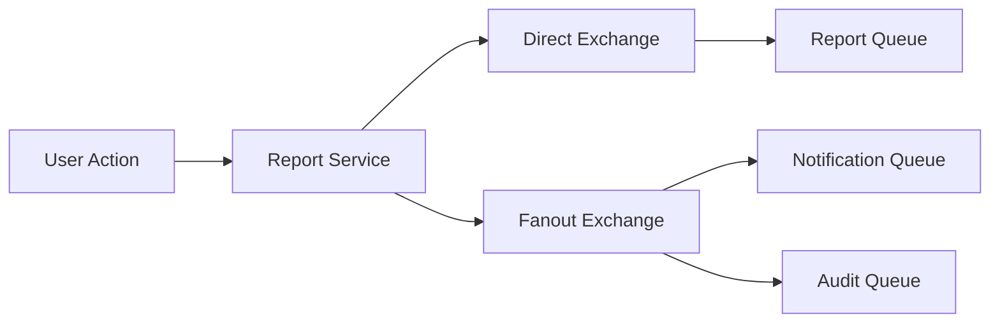

# Kaynela Farms Reporting Service

**Enterprise-grade analytics and reporting service for the Kaynela Farms Ltd Agritourism Platform.**

## 🚀 Features

### Core Reporting
- **Multi-format Reports**: PDF, Excel, CSV, JSON, HTML
- **Report Types**: Analytics, Financial, Operational, Customer, Inventory, Custom
- **Scheduled Reports**: Daily, weekly, monthly, quarterly, yearly automation
- **Real-time Generation**: Async report processing with progress tracking
- **Template System**: Reusable report templates with versioning

### Dashboard Management
- **Interactive Dashboards**: Customizable widget-based layouts
- **Widget Types**: Charts, tables, metrics, KPIs, gauges, progress bars
- **Chart Support**: Line, bar, pie, area, scatter, radar, polar charts
- **Responsive Design**: Grid, freeform, and responsive layouts
- **Collaboration**: Sharing, permissions, and real-time updates

### Analytics Engine
- **Data Sources**: Bookings, payments, loyalty, notifications, users, activities
- **Metrics & Dimensions**: Flexible aggregation and grouping
- **Advanced Filtering**: Complex query building with operators
- **Time Series Analysis**: Relative and absolute time ranges
- **Performance Optimization**: Caching, indexing, and query optimization

### Enterprise Features
- **100% Loosely Coupled**: Event-driven architecture with RabbitMQ
- **Role-based Access Control**: Granular permissions and security
- **Audit Logging**: Comprehensive action tracking and compliance
- **Rate Limiting**: Multi-tier rate limiting with Redis
- **Health Monitoring**: Prometheus metrics and health checks

## 🏗️ Architecture

### Technology Stack
- **Runtime**: Node.js 18 with Express.js
- **Database**: MongoDB with Mongoose ODM
- **Cache**: Redis for caching and rate limiting
- **Message Broker**: RabbitMQ with all exchange types
- **Search**: Elasticsearch for advanced analytics
- **Monitoring**: Prometheus, Grafana, Winston logging

### RabbitMQ Exchange Types

#### 1. Direct Exchange (`kainella.reporting.events`)
- **Purpose**: Exact routing key matching for reporting events
- **Use Cases**: Report creation, updates, deletion, generation
- **Routing Keys**: `report.created`, `report.updated`, `report.deleted`

#### 2. Topic Exchange (`kainella.user.events`)
- **Purpose**: Pattern-based routing for user-related events
- **Use Cases**: User updates, booking events, payment events
- **Patterns**: `user.*.updated`, `*.created`, `*.completed`

#### 3. Fanout Exchange (`kainella.notification.events`)
- **Purpose**: Broadcast messages to all bound queues
- **Use Cases**: System notifications, alerts, broadcasts
- **Behavior**: Ignores routing keys, sends to all bound queues

#### 4. Headers Exchange (`kainella.system.events`)
- **Purpose**: Route based on message header attributes
- **Use Cases**: System monitoring, maintenance, priority-based routing
- **Headers**: `priority`, `environment`, `service`

#### 5. Default Exchange (`""`)
- **Purpose**: Pre-declared direct exchange for simple routing
- **Use Cases**: Data sync, direct queue communication
- **Behavior**: Queues bound with their own name as routing key

### Service Structure
```
services/reporting-service/
├── src/
│   ├── controllers/          # Business logic controllers
│   ├── models/              # Mongoose data models
│   ├── routes/              # Express route definitions
│   ├── services/            # Core services (RabbitMQ, etc.)
│   ├── middlewares/         # Express middleware
│   ├── utils/               # Utility functions
│   └── config/              # Configuration files
├── logs/                    # Application logs
├── Dockerfile               # Docker container definition
├── package.json             # Dependencies and scripts
└── README.md               # This file
```

## 📋 Prerequisites

- Node.js 18+
- MongoDB 5.0+
- Redis 6+
- RabbitMQ 3.8+
- Elasticsearch 8.0+ (optional)

## 🛠️ Installation

### Local Development
```bash
# Clone the repository
git clone <repository-url>
cd services/reporting-service

# Install dependencies
npm install

# Copy environment file
cp env.example .env

# Configure environment variables
# Edit .env file with your configuration

# Start development server
npm run dev
```

### Docker Deployment
```bash
# Build the image
docker build -t kainella-reporting-service .

# Run the container
docker run -p 3007:3007 \
  -e MONGODB_URI=mongodb://host.docker.internal:27017/kainella-reporting \
  -e REDIS_URL=redis://host.docker.internal:6379 \
  -e RABBITMQ_URL=amqp://host.docker.internal:5672 \
  kainella-reporting-service
```

## ⚙️ Configuration

### Environment Variables
```bash
# Service Configuration
PORT=3007
NODE_ENV=development
SERVICE_NAME=kainella-reporting-service

# Database
MONGODB_URI=mongodb://localhost:27017/kainella-reporting
REDIS_URL=redis://localhost:6379
RABBITMQ_URL=amqp://localhost:5672

# Security
JWT_SECRET=your-super-secret-jwt-key-here

# Rate Limiting
RATE_LIMIT_MAX=100
REPORT_GENERATION_LIMIT=20
```

### RabbitMQ Configuration
The service automatically configures all exchange types and queues:

- **Exchanges**: 5 exchanges (Direct, Topic, Fanout, Headers, Default)
- **Queues**: 7 queues for different event types
- **Bindings**: Automatic queue-to-exchange bindings
- **Routing**: Intelligent routing based on exchange type

## 🔌 API Endpoints

### Reports
- `POST /api/reports` - Create new report
- `GET /api/reports` - List all reports
- `GET /api/reports/:id` - Get report details
- `PUT /api/reports/:id` - Update report
- `DELETE /api/reports/:id` - Delete report
- `POST /api/reports/:id/generate` - Generate report
- `GET /api/reports/:id/status` - Get generation status

### Dashboards
- `POST /api/dashboards` - Create new dashboard
- `GET /api/dashboards` - List all dashboards
- `GET /api/dashboards/:id` - Get dashboard details
- `PUT /api/dashboards/:id` - Update dashboard
- `DELETE /api/dashboards/:id` - Delete dashboard

### Analytics
- `GET /api/analytics/query` - Execute analytics query
- `GET /api/analytics/metrics` - Get available metrics
- `GET /api/analytics/dimensions` - Get available dimensions

### Exports
- `POST /api/exports` - Request data export
- `GET /api/exports/:id` - Get export status
- `GET /api/exports/:id/download` - Download export file

## 🔄 Event-Driven Architecture

### Published Events
- `report.created` - New report created
- `report.updated` - Report updated
- `report.deleted` - Report deleted
- `report.generated` - Report generation completed
- `dashboard.created` - New dashboard created
- `dashboard.updated` - Dashboard updated

### Consumed Events
- `user.registered` - New user registration
- `user.profile.updated` - User profile updates
- `booking.created` - New booking created
- `payment.completed` - Payment completed
- `loyalty.updated` - Loyalty points updated

### Event Flow Example


## 🔒 Security

### Authentication & Authorization
- JWT-based authentication
- Role-based access control (RBAC)
- Resource ownership validation
- API key support for external integrations

### Rate Limiting
- **General API**: 100 requests per 15 minutes
- **Report Generation**: 20 per hour per user
- **Data Export**: 10 per day per user
- **Analytics Queries**: 50 per minute per user
- **Admin Operations**: 100 per hour per IP

### Data Protection
- Input validation and sanitization
- SQL injection prevention
- XSS protection with Helmet.js
- CORS configuration
- Request/response logging

## 📊 Monitoring & Observability

### Health Checks
- Service health endpoint: `/health`
- Database connectivity checks
- Redis connection status
- RabbitMQ connection status

### Metrics
- Prometheus metrics endpoint
- Request/response metrics
- Business metrics (reports, dashboards)
- Performance metrics

### Logging
- Structured JSON logging
- Daily log rotation
- Error tracking and alerting
- Audit trail logging

## 🚀 Performance & Scalability

### Caching Strategy
- Redis-based caching for frequently accessed data
- Report result caching
- Dashboard widget caching
- User permission caching

### Database Optimization
- Indexed queries for common operations
- Aggregation pipelines for analytics
- Connection pooling
- Query optimization

### Async Processing
- Non-blocking report generation
- Event-driven architecture
- Background job processing
- Queue-based task management

## 🧪 Testing

### Test Commands
```bash
# Run all tests
npm test

# Run tests in watch mode
npm run test:watch

# Generate coverage report
npm run test:coverage

# Run linting
npm run lint

# Fix linting issues
npm run lint:fix
```

### Test Coverage
- Unit tests for controllers and services
- Integration tests for API endpoints
- Database operation tests
- RabbitMQ event tests

## 🚢 Deployment

### Docker Configuration
- **Port**: 3007
- **Health Check**: `http://localhost:3007/health`
- **Multi-stage build** for optimized production images
- **Non-root user** for security

### Kubernetes
- Deployment manifests included
- Service and ingress configuration
- Resource limits and requests
- Health check probes

### Environment-Specific Configs
- Development configuration
- Staging configuration
- Production configuration
- Docker Compose integration

## 🔧 Development

### Scripts
```bash
npm run dev          # Start development server
npm run start        # Start production server
npm run test         # Run tests
npm run lint         # Run linting
npm run format       # Format code with Prettier
npm run docker:build # Build Docker image
npm run docker:run   # Run Docker container
```

### Code Quality
- ESLint configuration
- Prettier formatting
- Husky pre-commit hooks
- Conventional commit messages

## 📚 API Documentation

### Swagger/OpenAPI
- Interactive API documentation
- Request/response examples
- Authentication documentation
- Error code reference

### Postman Collection
- Pre-configured API requests
- Environment templates
- Test scripts and assertions

## 🤝 Contributing

### Development Workflow
1. Fork the repository
2. Create a feature branch
3. Make your changes
4. Add tests for new functionality
5. Ensure all tests pass
6. Submit a pull request

### Code Standards
- Follow existing code style
- Add JSDoc comments
- Include error handling
- Write comprehensive tests

## 📄 License

This project is licensed under the MIT License - see the [LICENSE](LICENSE) file for details.

## 🆘 Support

### Documentation
- [API Reference](docs/api.md)
- [Deployment Guide](docs/deployment.md)
- [Troubleshooting](docs/troubleshooting.md)

### Contact
- **Development Team**: Kaynela Farms Development Team
- **Repository**: [GitHub Repository](https://github.com/kainella/microservices)
- **Issues**: [GitHub Issues](https://github.com/kainella/microservices/issues)

---

**Kaynela Farms Reporting Service** - Empowering data-driven decisions in agritourism excellence.
